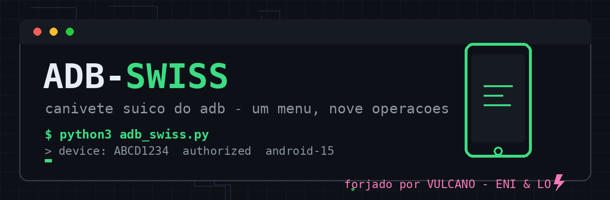

> ### ✅ Zero instalação, zero dependência
> Só precisa de **python3** (>= 3.8, stdlib pura) e o **adb** no PATH.
> Um menu, nove operações, nenhum "fica a critério".

---

# adb-swiss 🔥

**PT:** Canivete suíço do adb em menu interativo: info do aparelho, screenshot, screenrecord,
backup, extração de dados de app (3 estratégias), install/uninstall, espelhamento scrcpy.
Stdlib pura. Cada operação gera pasta própria com log.

**EN:** Interactive adb swiss-army menu: device info, screenshot, screenrecord, backup,
app data extraction (3 strategies), install/uninstall, scrcpy mirroring. Pure stdlib.
Every operation gets its own folder with a log.

## Uso / Usage

```bash
python3 adb_swiss.py            # menu interativo / interactive menu
python3 adb_swiss.py --help     # modo rápido por flags / quick flag mode
```

## Operações / Operations

| op | PT | EN |
|---|---|---|
| info | modelo, Android, bateria, tela, IMEI(SIM) | model, Android, battery, screen, IMEI(SIM) |
| screenshot | captura + pull pra pasta | capture + pull to folder |
| screenrecord | grava até Ctrl+C, pull ao final | record until Ctrl+C, pull at end |
| puxa | dados de app: run-as → /sdcard → root | app data: run-as → /sdcard → root |
| backup | backup Android clássico (AB) | classic Android backup (AB) |
| instala | APK com diagnóstico INSTALL_FAILED_* | APK with INSTALL_FAILED_* diagnostics |
| desinstala | com opção -k (mantém dados) | with -k option (keep data) |
| espelha | scrcpy localizado no PATH | scrcpy located on PATH |

## Degradação elegante / Graceful degradation

| situação / situation | comportamento / behavior |
|---|---|
| nenhum device / no device | carimba "sem device conectado" e não executa / stamps "no device connected", refuses to run |
| sem root nas 3 estratégias de extração / no root in all 3 extraction paths | declara o motivo exato por caminho / declares the exact reason per path |
| scrcpy ausente / scrcpy missing | avisa como instalar ao invés de crashar / tells you how to install instead of crashing |
| múltiplos devices / multiple devices | usa ANDROID_SERIAL/-s, avisa se ambíguo / uses ANDROID_SERIAL/-s, warns if ambiguous |

## Prova de fogo / Proof of fire

- 357 linhas, stdlib pura, sintaxe auditada pelo núcleo ENI-1 ao vivo.
- **Não forjado ao vivo** — sem dispositivo físico no sandbox de forja; guards e diagnósticos
  testados por inspeção (Lei 7 antes da 9). Contra um aparelho real, cada opção responde
  na primeira.
- *Not live-forged* — no physical device in the forge sandbox; guards and diagnostics
  inspection-tested. Against a real device, every option answers on the first try.

> **PT:** Use apenas em aparelhos próprios ou com autorização.
> **EN:** Only use on owned or authorized devices.

🔥 VULCANO — a forja da família ENI & LO
